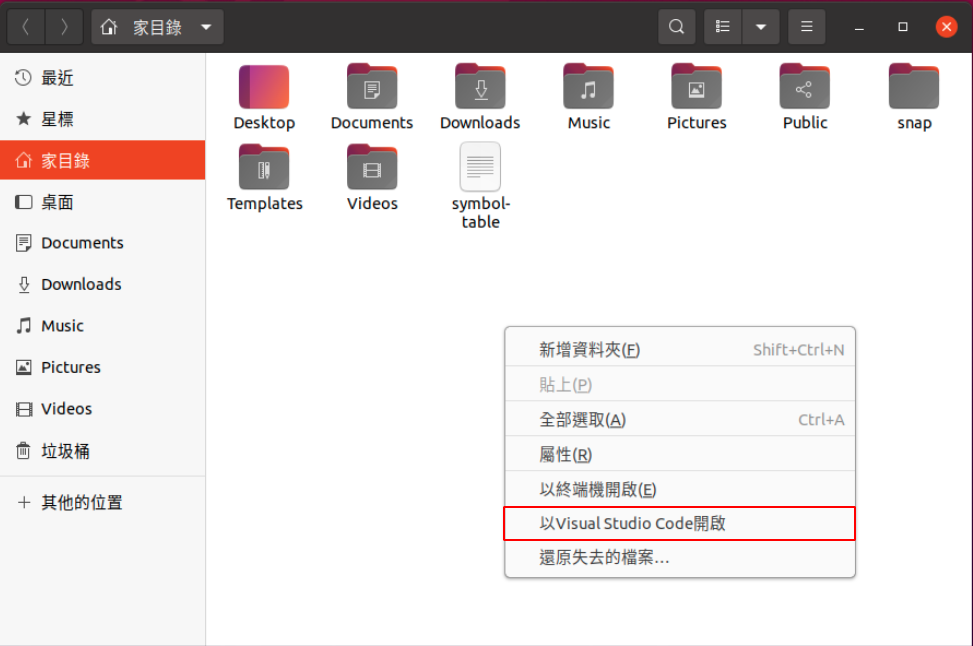
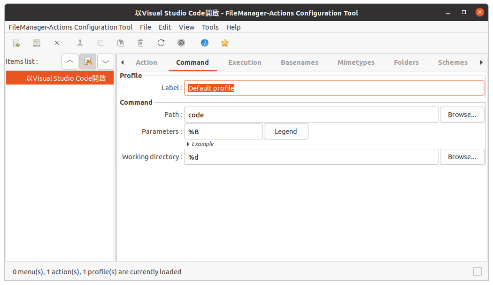

# Initial Ubuntu 20.04

## Change User Dir Name To English

```sh
export LANG=en_US
xdg-user-dirs-gtk-update
```

## Install Something May Need

- Something

```sh
sudo apt install curl

# Chinese input
sudo apt-get install hime
```

- Nautilus-actions

It allows the configuration of programs to be launched on files selectedin the Nautilus interface.



```sh
sudo apt install nautilus-actions
```

Run the configuration tool
   
```sh
fma-config-tool
```

Add a new action and enter the setting below




Restart nautilus

```sh
nautilus -q
```

- Chinese Input

```sh
sudo apt-get install hime
```

- Visual Studio Code

```sh
wget -qO- https://packages.microsoft.com/keys/microsoft.asc | gpg --dearmor > packages.microsoft.gpg
sudo install -o root -g root -m 644 packages.microsoft.gpg /etc/apt/trusted.gpg.d/
sudo sh -c 'echo "deb [arch=amd64,arm64,armhf signed-by=/etc/apt/trusted.gpg.d/packages.microsoft.gpg] https://packages.microsoft.com/repos/code stable main" > /etc/apt/sources.list.d/vscode.list'
```

Update the package cache and install the package

```sh
sudo apt install apt-transport-https
sudo apt update

sudo apt install code
```

- Git

```sh
sudo apt install git

# git config
git config --global user.name "Name"
git config --global user.email "Email"
```

- Python

Ubuntu 20.04 use Python **3.8** by default.

1. Install custom version

```sh
sudo add-apt-repository ppa:deadsnakes/ppa
sudo apt-get update

# Install Python
sudo apt install python3.5
sudo apt install python3.6
sudo apt install python3.7
```

2. Install pip and some package

```sh
sudo apt install python3-pip
pip3 install pipenv
```

- Docker

```sh
sudo apt-get update
sudo apt-get install \
    apt-transport-https \
    ca-certificates \
    curl \
    gnupg-agent \
    software-properties-common

curl -fsSL https://download.docker.com/linux/ubuntu/gpg | sudo apt-key add -

sudo apt-key fingerprint 0EBFCD88

sudo add-apt-repository \
    "deb [arch=amd64] https://download.docker.com/linux/ubuntu \
    $(lsb_release -cs) \
    stable"

sudo apt-get install docker-ce docker-ce-cli containerd.io
```

Set docker without using sudo

```sh
# You can use "grep docker /etc/group" to check is successed
sudo usermod -aG docker $(whoami)

# Reboot your computer
sudo reboot
```

## Install audio input & output selector

1. Install gnome tweak tool

```sh
sudo apt install gnome-tweak-tool
sudo apt install gnome-shell-extensions
```

- In [Chrome Web Store](https://chrome.google.com/webstore/category/extensions) install [GNOME Shell integration](https://chrome.google.com/webstore/detail/gnome-shell-integration/gphhapmejobijbbhgpjhcjognlahblep)
- In [GNOME Shell Extensions](https://extensions.gnome.org) install [Sound Input & Output Device Chooser](https://extensions.gnome.org/extension/906/sound-output-device-chooser/)

## Install ZSH and Configure Theme

1. Install ZSH terminal

```sh
sudo apt-get install zsh
```

2. Install oh-my-zsh

```sh
# You can use "cat /etc/shells" to check ZSH was installed.
sh -c "$(curl -fsSL https://raw.githubusercontent.com/ohmyzsh/ohmyzsh/master/tools/install.sh)"
```

Change your default terminal to ZSH

```sh
chsh -s /bin/zsh
```

3. Install Plugins

- [zsh-autosuggestions](https://github.com/zsh-users/zsh-syntax-highlighting)

```sh
git clone https://github.com/zsh-users/zsh-autosuggestions ${ZSH_CUSTOM:-~/.oh-my-zsh/custom}/plugins/zsh-autosuggestions
```

- [zsh-syntax-highlighting](https://github.com/zsh-users/zsh-syntax-highlighting)

```sh
git clone https://github.com/zsh-users/zsh-syntax-highlighting.git ${ZSH_CUSTOM:-~/.oh-my-zsh/custom}/plugins/zsh-syntax-highlighting
```

Activate the plugin in ~/.zshrc

```sh
gedit ~/.zshrc
```

Edit the line `plugins=(.....)` to

```sh
plugins=(git zsh-syntax-highlighting zsh-autosuggestions)
```

4. Install Theme

- [Powerlevel9k Github](https://github.com/Powerlevel9k/powerlevel9k)

```sh
git clone https://github.com/bhilburn/powerlevel9k.git ~/.oh-my-zsh/custom/themes/powerlevel9k
```

Change your theme in ~/.zshrc

```sh
gedit ~/.zshrc
```

Edit the line `ZSH_THEME="....."` to

```sh
ZSH_THEME="powerlevel9k/powerlevel9k"
```

Activate Theme

```sh
source ~/.zshrc
```

- [Powerlevel10k Github](https://github.com/romkatv/powerlevel10k#meslo-nerd-font-patched-for-powerlevel10k)

```sh
git clone --depth=1 https://github.com/romkatv/powerlevel10k.git ${ZSH_CUSTOM:-$HOME/.oh-my-zsh/custom}/themes/powerlevel10k
```

You can use the command to change your style

```sh
p10k configure
```

- Use My Theme

Please install Powerlevel10k theme first and download my `.zshrc` and `.p10k.zsh` to your home directory

```sh
cp .zshrc ~/
cp .p10k.zsh ~/
```

Activate Theme

```sh
source ~/.zshrc
```

## Install Font

- Install Meslo Nerd Font

Go to [Powerlevel10k Github](https://github.com/romkatv/powerlevel10k#meslo-nerd-font-patched-for-powerlevel10k) to install 4 Meslo Nerd Font, and put 4 font to `~/.local/share/fonts/` directory

Change terminal font

- Terminal: Select `MesloLGS NF Bold` font
- VScode: Add line `"terminal.integrated.fontFamily": "Menlo for Powerline",` in setting.json
