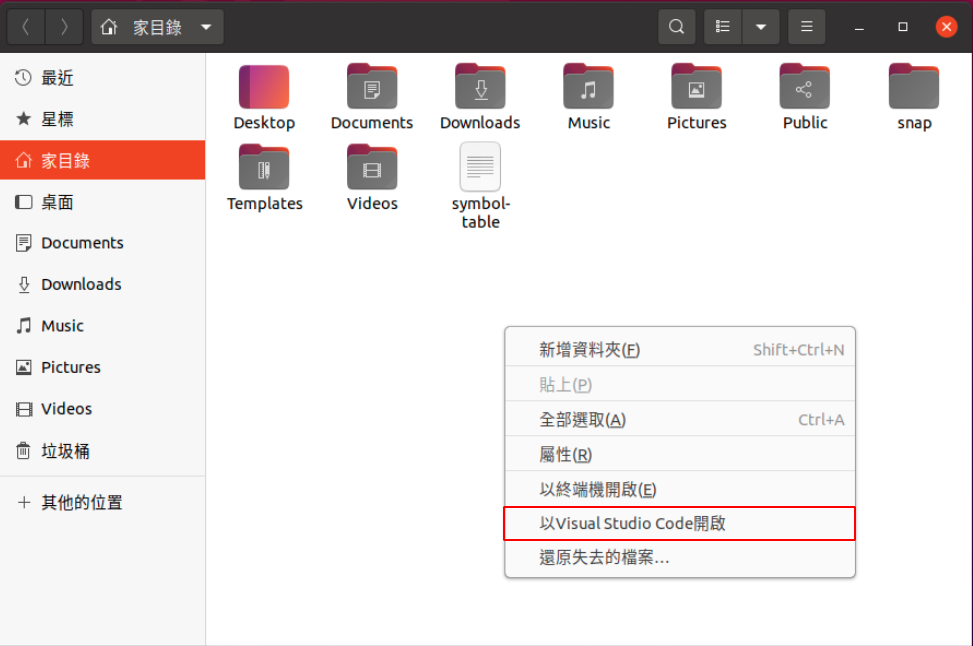
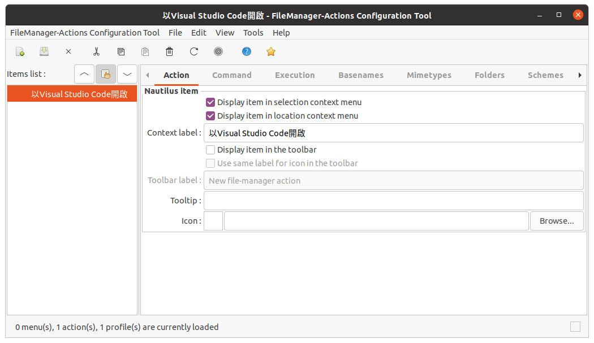
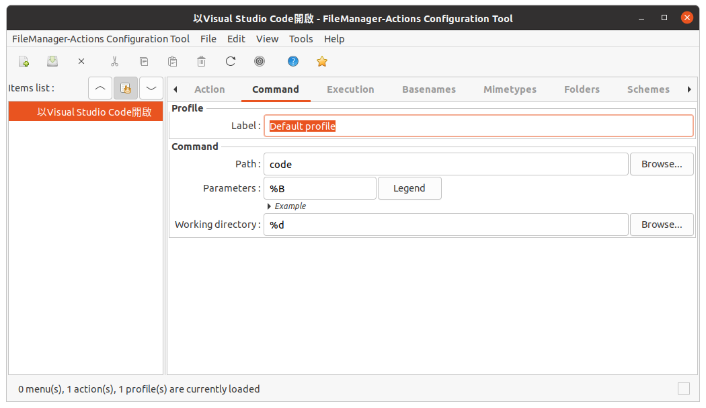

# Nautilus

## Install Nautilus Actions

It allows the configuration of programs to be launched on files selectedin the Nautilus interface.



```bash
sudo apt install nautilus-actions
```

Run the configuration tool
   
```bash
fma-config-tool
```

Add a new action and enter the setting below





Restart nautilus

```bash
nautilus -q
```
